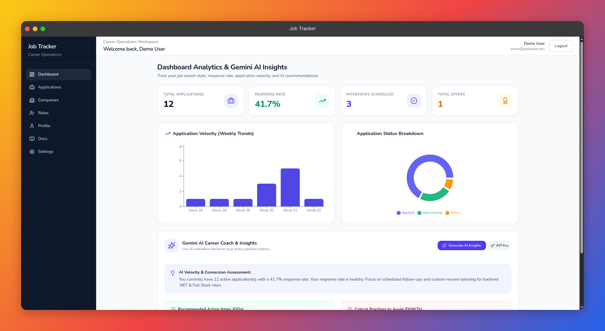
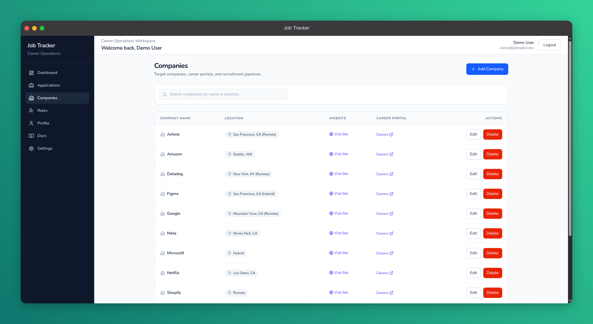
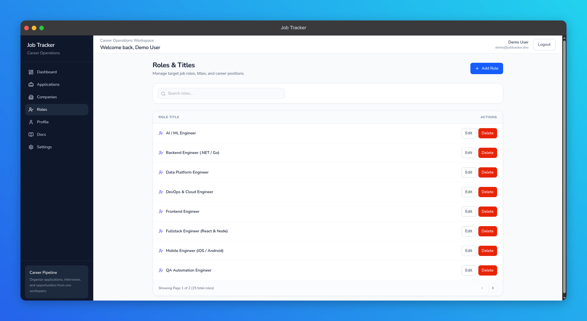
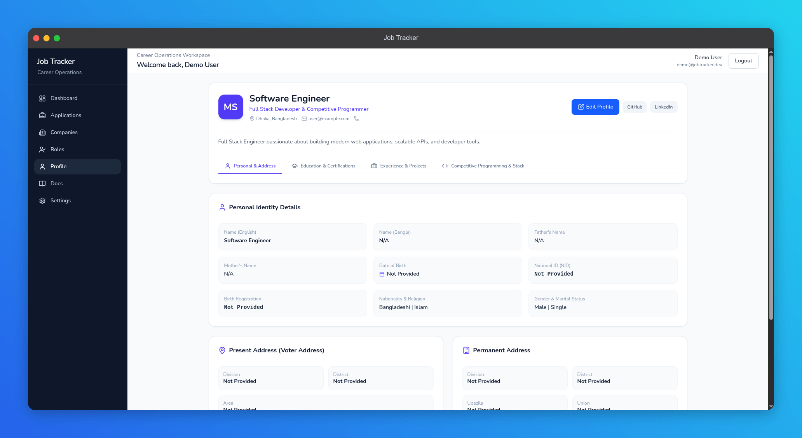
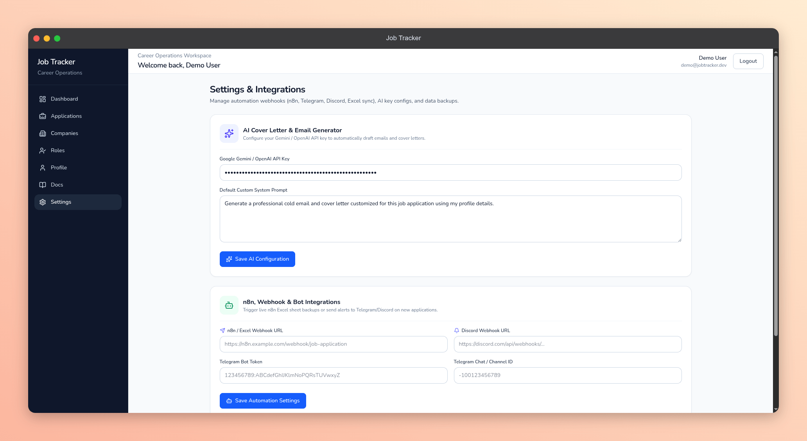

# 💼 JobTracker — Open-Source Job Application Operating System

[](https://github.com/maruf-pfc/job-tracker/actions/workflows/backend-ci.yml)
[](https://github.com/maruf-pfc/job-tracker/actions/workflows/frontend-ci.yml)
[](https://github.com/maruf-pfc/job-tracker/actions/workflows/docker-ci.yml)
[](https://github.com/maruf-pfc/job-tracker/actions/workflows/codeql.yml)
[](LICENSE)
[](https://dotnet.microsoft.com/)
[](https://react.dev/)
[](https://tailwindcss.com/)
[](https://job-trackerr.vercel.app)

An open-source, full-stack job application tracking platform built for structured career management, Kanban application pipeline tracking, Gemini AI career coaching, and productivity-focused analytics.

🌐 **Live Production App**: [https://job-trackerr.vercel.app](https://job-trackerr.vercel.app)

Designed as a high-performance **personal career operating system** — not just a standard CRUD dashboard.

---

## 🌟 Instant Zero-Config Showcase Data (For Contributors & Reviewers)

When you clone and run this project for the first time, **you don't need to manually create companies, job applications, or target roles!**

The backend automatically seeds the database on initial startup with:
- 🏢 **12 Top Tech Companies**: Google, Microsoft, Shopify, Vercel, Stripe, Meta, Amazon, Netflix, Datadog, Uber, Airbnb, Figma.
- 📋 **12 Realistic Showcase Job Applications**: Pre-populated with salary ranges, locations, statuses (Saved, Applied, Interview, Offer, Rejected), follow-up reminders, and Markdown interview prep notes.
- 🎯 **15 Modern Target Tech Roles**: Senior Frontend Developer, Backend Engineer (.NET / Go), Fullstack Architect, Site Reliability Engineer, AI/ML Engineer, etc.
- 👤 **Clean Demo Profile**: Accessible instantly via `demo@jobtracker.dev`.

---

## 📸 Screenshots & UI Showcase

### 1. Analytics & Overview Dashboard


### 2. Application Pipeline (Kanban Board)


### 3. Application List & Filtering Table


### 4. Target Companies Management (with Pagination)


### 5. Target Job Roles & Career Titles


### 6. User Profile & Academic Details


### 7. Integrations & Webhook Settings


---

## ⚡ Tech Stack Architecture

### Frontend (Client)
- **Core Framework**: React 19 + TypeScript + Vite 8
- **Styling & Motion**: TailwindCSS v4, Framer Motion (`framer-motion`), Lenis Smooth Scroll (`lenis`), `@formkit/auto-animate`
- **State & Data Fetching**: React Query (TanStack Query v5), Zustand
- **Tooling & Test Runner**: Bun, Vitest, Testing Library, Lucide Icons, Sonner Toasts, Recharts

### Backend (Server)
- **Core Framework**: ASP.NET Core 10.0 Web API
- **Database & ORM**: PostgreSQL (Local / Neon Cloud) via Entity Framework Core 10
- **Security & Auth**: ASP.NET Core Identity, JWT Token Authentication, Rate Limiting, Security Headers
- **Logging & Monitoring**: Serilog Structured Logging, OpenAPI / Swagger
- **Testing**: xUnit, Moq, EF Core InMemory Provider

---

## 🚀 Quickstart & Local Setup Guide

### Prerequisites
Make sure you have the following tools installed on your local machine:
- [.NET 10.0 SDK](https://dotnet.microsoft.com/download/dotnet/10.0)
- [Bun](https://bun.sh/) (`>= 1.1`) or Node.js (`>= 20.0`)
- [PostgreSQL](https://www.postgresql.org/) (or use Docker / Neon Cloud)

---

### Step 1: Clone the Repository
```bash
git clone https://github.com/maruf-pfc/job-tracker.git
cd job-tracker
```

---

### Step 2: Start the Backend Server

1. Navigate to the API folder:
   ```bash
   cd server/JobTracker.API
   ```
2. Set up your environment configuration in `appsettings.json` (or use default local PostgreSQL connection string):
   ```json
   "ConnectionStrings": {
     "DefaultConnection": "Host=localhost;Database=JobTrackerDb;Username=postgres;Password=postgres"
   }
   ```
3. Restore dependencies and run the server:
   ```bash
   dotnet restore
   dotnet run
   ```
   > 💡 **Automatic Database Seeding**: On startup, Entity Framework Core applies pending database migrations and executes `DbSeeder.cs`, automatically seeding 12 top tech companies, 12 applications, 15 job roles, and the demo user!

- **API Swagger Documentation**: `http://localhost:5104/swagger`

---

### Step 3: Start the Frontend Client

1. Open a new terminal and navigate to the client directory:
   ```bash
   cd client
   ```
2. Install dependencies with Bun:
   ```bash
   bun install
   ```
3. Launch the Vite development server:
   ```bash
   bun run dev
   ```
4. Open `http://localhost:5173` in your browser!

---

## 🧪 Running Unit & Integration Tests

### 1. Backend Test Suite (22 / 22 Tests Passing)
Runs unit tests for services, controllers, JWT helpers, and database constraints using xUnit and EF Core InMemory provider:

```bash
cd server/JobTracker.API.Tests
dotnet test
```

### 2. Frontend Test Suite (15 / 15 Tests Passing)
Runs client unit tests using Vitest and React Testing Library:

```bash
cd client
bun run test
```

### 3. Production Build Validation
Validate client TypeScript compilation and Vite bundle production build:

```bash
cd client
bun run build
```

---

## 🐛 Debugging Guide

### VS Code Debugging
Create or use `.vscode/launch.json` to attach to both server and client debugging instances:

```json
{
  "version": "0.2.0",
  "configurations": [
    {
      "name": ".NET Core Launch (API)",
      "type": "coreclr",
      "request": "launch",
      "preLaunchTask": "build",
      "program": "${workspaceFolder}/server/JobTracker.API/bin/Debug/net10.0/JobTracker.API.dll",
      "args": [],
      "cwd": "${workspaceFolder}/server/JobTracker.API",
      "stopAtEntry": false,
      "serverReadyAction": {
        "action": "openUrl",
        "pattern": "\\bNow listening on:\\s+(https?://\\S+)",
        "uriFormat": "%s/swagger"
      }
    }
  ]
}
```

---

## 🐳 Docker & Docker Compose Setup

Run the full production stack (PostgreSQL, ASP.NET Core 10 Web API, Nginx Static Frontend) with a single command:

```bash
docker compose up --build -d
```

- **Frontend Web App**: `http://localhost`
- **Backend Web API**: `http://localhost:8080`
- **PostgreSQL Database**: `localhost:5432`

To stop all containers:
```bash
docker compose down
```

---

## ⚙️ GitHub Actions CI/CD Pipelines

This repository includes automated GitHub Actions workflows running on every push and pull request:

| Workflow | File | Description |
| :--- | :--- | :--- |
| **Server CI** | [backend-ci.yml](.github/workflows/backend-ci.yml) | Restores, builds, and executes 22 xUnit backend unit tests on .NET 10. |
| **Client CI** | [frontend-ci.yml](.github/workflows/frontend-ci.yml) | Installs dependencies, runs 15 Vitest tests, and validates Vite production build with Bun. |
| **Docker Compose CI** | [docker-ci.yml](.github/workflows/docker-ci.yml) | Validates Dockerfile build environments for both frontend and backend. |
| **CodeQL Advanced** | [codeql.yml](.github/workflows/codeql.yml) | Automated security scanning for C# and JavaScript/TypeScript. |

---

## 📚 Technical Documentation Collection

Comprehensive architecture guides, database ER diagrams, REST API contracts, and troubleshooting records are available in the [`docs/`](docs/) directory:

- 🏗 **[System Architecture & Design](docs/architecture.md)**: Clean architecture layers, component diagrams, system overview.
- 🗄 **[Database Model & Schema](docs/database_schema.md)**: PostgreSQL ER Diagram, table constraints, indices, and UTC timestamp mappings.
- 🔌 **[REST API Specifications](docs/api_documentation.md)**: Endpoints reference, request/response DTO schemas, JWT auth requirements.
- 🛠 **[Troubleshooting & Bug Fixes](docs/troubleshooting_and_bugfixes.md)**: Empirical root cause analysis and resolution log (FK 23503, UTC timestamps, JWT lifetime, seeding, query caching).
- 🚀 **[Deployment & Webhooks Guide](docs/deployment_and_webhooks.md)**: Docker Compose orchestration, Vercel monorepo settings, n8n / Discord / Telegram integrations.

---

## 🤝 Contributing Guidelines

We welcome open-source contributions! Follow these steps to contribute:

1. **Fork the Repository** on GitHub.
2. **Create a Feature Branch**: `git checkout -b feature/amazing-feature`
3. **Commit your Changes**: `git commit -m "feat: add amazing feature"`
4. **Push to Branch**: `git push origin feature/amazing-feature`
5. **Open a Pull Request** against the `main` or `dev` branch.

> 🔒 **Security Notice**: Please ensure no personal credentials, API keys, or hardcoded sensitive data are included in your contributions.

---

## 📄 License

This project is licensed under the [MIT License](LICENSE).
