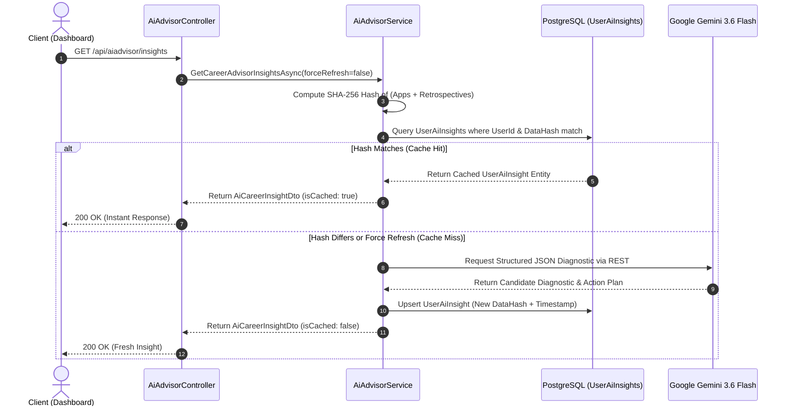

# 🏗 System Architecture & Design

## Overview

JobTracker follows **Clean Architecture** principles separating domain entities, data access persistence, business services, and presentation controllers.

```
┌─────────────────────────────────────────────────────────────┐
│                 React 19 Frontend (Vite 8)                  │
│       TailwindCSS v4 • Framer Motion • TanStack Query       │
└──────────────────────────────┬──────────────────────────────┘
                               │  REST API (JSON over HTTPS)
                               ▼
┌─────────────────────────────────────────────────────────────┐
│                 ASP.NET Core 10 Web API                     │
│      JWT Auth • Rate Limiting • Controllers & Middleware     │
└──────────────┬───────────────────────────────┬──────────────┘
               │                               │
               ▼                               ▼
┌─────────────────────────────┐ ┌─────────────────────────────┐
│      Business Services      │ │      AI Career Advisor      │
│ Applications, Retrospectives│ │ Gemini Flash + SHA256 Cache │
└──────────────┬──────────────┘ └──────────────┬──────────────┘
               │                               │
               ▼                               ▼
┌─────────────────────────────────────────────────────────────┐
│             Entity Framework Core 10 (Npgsql)               │
│                  AppDbContext & Migrations                  │
└──────────────────────────────┬──────────────────────────────┘
                               │
                               ▼
┌─────────────────────────────────────────────────────────────┐
│               PostgreSQL Database (Neon Cloud)              │
│       UTC Timestamps • Multi-Tenant Foreign Keys & Indexes  │
└─────────────────────────────────────────────────────────────┘
```

---

## 🤖 AI Career Advisor Smart Caching Architecture

To achieve sub-second response times and prevent unnecessary AI API costs, the AI Advisor implements a cryptographic pipeline state signature:



---

## 🔒 Multi-Tenant Data Isolation

- **Per-User Entities**: `JobApplication`, `RejectionRetrospective`, `UserProfile`, and `UserAiInsight` strictly enforce `UserId == currentUser.UserId`.
- **Hybrid Lookups**: `Company`, `JobRole`, and `SourcePlatform` support a hybrid lookup model:
  - Global standard templates have `UserId == null` (visible to all users as defaults).
  - User-created custom records have `UserId == currentUser.UserId` (visible, editable, and deletable only by the creator).
