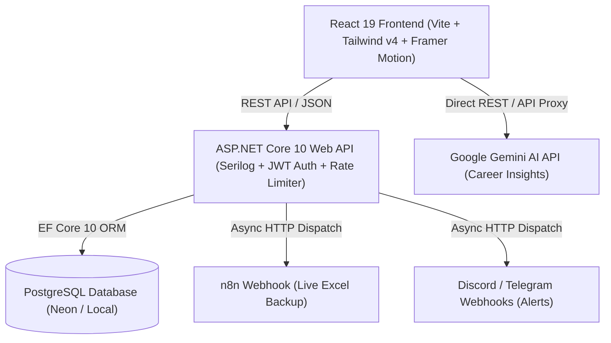

# 🏗️ System Architecture & Design

## Overview

JobTracker is engineered as a high-performance, resilient **Personal Career Operating System**. It adopts a decoupled client-server architecture built on ASP.NET Core 10.0 Web API for the backend and React 19 + TypeScript + Vite for the frontend.



---

## 🏛 Layered Backend Architecture

The backend follows clean layered architecture principles:

```
server/JobTracker.API/
├── Controllers/         # REST API Endpoints (Auth, JobApplications, Companies, JobRoles, UserProfile)
├── Services/            # Business Logic Layer (CompanyService, JobApplicationService, etc.)
├── Interfaces/          # Abstraction Interfaces (ICompanyService, IJwtHelper, etc.)
├── Models/              # Domain Entity Models (BaseEntity, JobApplication, Company, UserProfile)
├── DTOs/                # Data Transfer Objects (Request/Response contracts)
├── Data/                # DbContext, Migrations, EF Core Configurations, DbSeeder
├── Helpers/             # JWT Generator, Password Hasher, Exception Filters
└── Configs/             # Serilog, CORS, Rate Limiting, Security Headers
```

### Layer Responsibilities
1. **Controllers Layer**: Handles HTTP requests, maps routing, enforces `[Authorize]` attributes, and formats standardized `ApiResponse<T>` envelopes.
2. **Business Services Layer**: Contains core domain logic, input validation, transaction boundaries, and EF Core operations.
3. **Domain Layer (`Models/`)**: Defines database entities inheriting from `BaseEntity` (which supplies `Id`, `CreatedAt`, and `UpdatedAt`).
4. **Data Layer (`Data/`)**: Configures PostgreSQL schema definitions via `AppDbContext`, EF Core Fluent API mappings, UTC date conversions, and database seeding.

---

## 🎨 Client-Side Architecture

The frontend client is built with React 19 and Vite 8:

```
client/src/
├── components/          # Modular Reusable UI & Application Components
│   ├── applications/   # Kanban Board, Application Cards, Modals, Forms
│   ├── layout/         # Header, Sidebar, Container, Navigation
│   └── ui/             # Standardized Buttons, Inputs, Dialogs, Skeletons
├── pages/               # Top-level Page Views (Dashboard, Kanban, Companies, Roles, Profile, Settings)
├── services/            # Axios API Clients & Service Modules
├── stores/              # Zustand Global State (AuthStore, UI Theme)
├── types/               # TypeScript Type Definitions & API Schemas
└── routes/              # Protected Route Guards & React Router v7 Config
```

### Key Frontend Capabilities
- **Responsive Mobile Navigation Drawer**: Seamlessly transitions between fixed desktop sidebar (`lg:flex`) and an interactive slide-out overlay drawer on mobile viewports (< 1024px) driven by `framer-motion` backdrop animations.
- **React Query (TanStack Query v5)**: Optimistic UI updates for 0ms interaction latency, query invalidation, and automatic background revalidation (`staleTime: 10s`).
- **Lenis Smooth Scroll & Framer Motion**: Liquid inertia momentum scrolling and fluid page transitions.
- **Zustand State Management**: Lightweight global store for JWT token storage and user auth session persistence.
