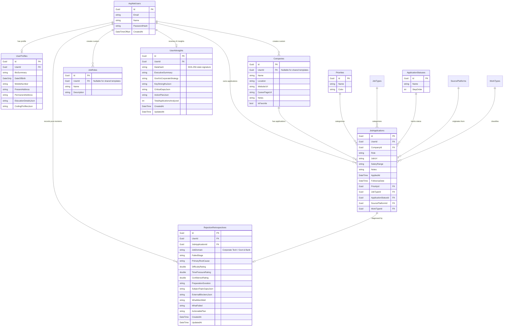

# 🗄 Database Model & Entity Schema

## Overview

JobTracker utilizes PostgreSQL as its relational database management system, managed via Entity Framework Core 10. All timestamps are strictly stored in `timestamp with time zone` (UTC) with database-generated `now()` default values.

---

## 📊 Entity Relationship (ER) Diagram

---

## 🔑 Database Indexes & Constraints

| Table | Index Name | Columns | Purpose |
| :--- | :--- | :--- | :--- |
| **`UserAiInsights`** | `IX_UserAiInsights_UserId_DataHash` | `(UserId, DataHash)` | O(1) Instant Cache Lookup by Pipeline State |
| **`RejectionRetrospectives`** | `IX_RejectionRetrospectives_JobApplicationId` | `JobApplicationId` (Unique) | Enforce 1 post-mortem survey per application |
| **`RejectionRetrospectives`** | `IX_RejectionRetrospectives_UserId_CreatedAt` | `(UserId, CreatedAt)` | Fast user-specific failure analytics queries |
| **`Companies`** | `IX_Companies_UserId_Name` | `(UserId, Name)` | Fast multi-tenant company lookup & uniqueness |
| **`JobRoles`** | `IX_JobRoles_UserId_Name` | `(UserId, Name)` | Fast multi-tenant role lookup & uniqueness |
| **`UserProfiles`** | `IX_UserProfiles_UserId` | `UserId` (Unique) | 1-to-1 Profile Mapping |
| **`JobApplications`** | `IX_JobApplications_UserId_AppliedAt` | `(UserId, AppliedAt)` | Chronological pipeline indexing |
