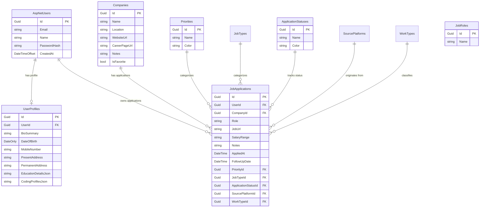

# 🗄 Database Model & Entity Schema

## Overview

JobTracker utilizes PostgreSQL as its relational database management system, managed via Entity Framework Core 10. All timestamps are strictly stored in `timestamp with time zone` (UTC) with database-generated `now()` default values.

---

## 📊 Entity Relationship (ER) Diagram

---

## 📝 Entity Definitions

### 1. `JobApplications` Entity
The core application record. Connects a user to a target company, role, status, priority, and application metadata.

| Column | Type | Constraints | Description |
| :--- | :--- | :--- | :--- |
| `Id` | `uuid` | Primary Key | Unique Identifier |
| `UserId` | `uuid` | Foreign Key | References `AspNetUsers.Id` |
| `CompanyId` | `uuid` | Foreign Key | References `Companies.Id` |
| `Role` | `varchar(200)` | Required | Position title |
| `JobUrl` | `text` | Optional | Link to job posting |
| `SalaryRange` | `varchar(100)` | Optional | Salary expectation |
| `Notes` | `text` | Optional | Markdown notes & interview prep |
| `AppliedAt` | `timestamptz` | Required | Application submission date |
| `FollowUpDate` | `timestamptz` | Optional | Reminder follow-up date |
| `PriorityId` | `uuid` | Foreign Key | References `Priorities.Id` |
| `JobTypeId` | `uuid` | Foreign Key | References `JobTypes.Id` |
| `ApplicationStatusId` | `uuid` | Foreign Key | References `ApplicationStatuses.Id` |
| `SourcePlatformId` | `uuid` | Foreign Key | References `SourcePlatforms.Id` |
| `WorkTypeId` | `uuid` | Foreign Key | References `WorkTypes.Id` |

### 2. `Companies` Entity
Stores target companies and corporate career portals.

| Column | Type | Constraints | Description |
| :--- | :--- | :--- | :--- |
| `Id` | `uuid` | Primary Key | Unique Identifier |
| `Name` | `varchar(200)` | Required | Company Name |
| `Location` | `varchar(200)` | Optional | HQ or office location |
| `WebsiteUrl` | `text` | Optional | Official site URL |
| `CareerPageUrl` | `text` | Optional | Careers page link |
| `Notes` | `text` | Optional | Tech stack notes |

### 3. `UserProfiles` Entity
Extends identity user with granular career and academic details. Includes 17 granular address fields, JSON education arrays, and coding profiles.

| Column | Type | Constraints | Description |
| :--- | :--- | :--- | :--- |
| `Id` | `uuid` | Primary Key | Unique Identifier |
| `UserId` | `uuid` | Foreign Key, Unique | References `AspNetUsers.Id` |
| `BioSummary` | `text` | Optional | Professional summary |
| `DateOfBirth` | `date` | Optional | Date of birth (`DateOnly?`) |
| `PresentAddress` | `text` | Optional | Present voter address |
| `PermanentAddress` | `text` | Optional | Permanent home address |
| `EducationDetailsJson` | `jsonb / text` | Optional | Academic background JSON array |
| `CodingProfilesJson` | `jsonb / text` | Optional | GitHub, LeetCode, Codeforces URLs |
